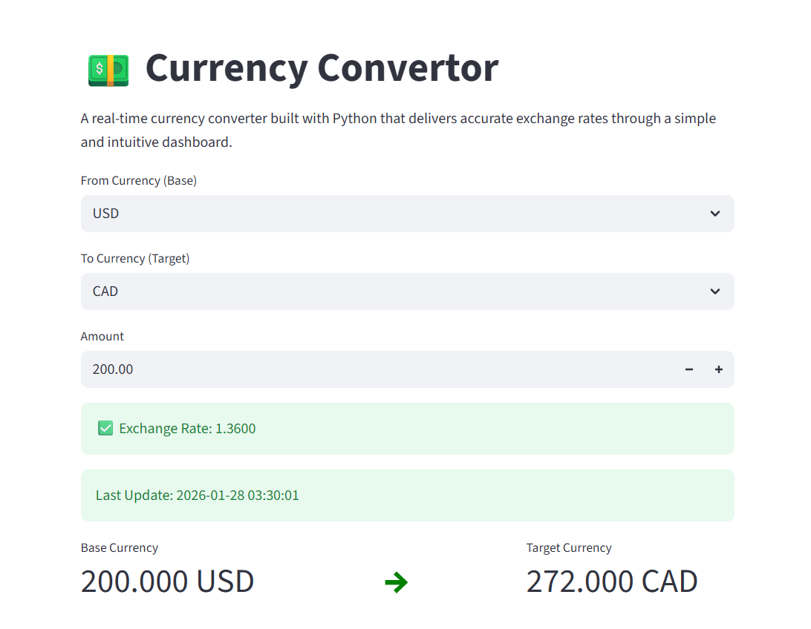

# 💱 Currency Converter (Python + API + Caching)

A **production-minded currency converter** built with Python to demonstrate **API consumption**, **caching strategies**, and **clean project architecture**.

This project focuses on **engineering fundamentals** such as performance optimization, separation of concerns, and maintainable code structure—not just UI.

## 🚀 Features

- 🔗 **Live exchange rates** via a REST API
- ⚡ **TTL-based caching** to minimize API calls
- 🧠 **Separation of concerns** (UI vs business logic)
- 📊 **Interactive UI** using Streamlit
- 🕒 **Last update timestamp** for data transparency
- 🧩 Modular and easily extensible design

## 🛠️ Tech Stack

| Area        | Technology |
|------------|-----------|
| Language    | Python 3 |
| UI          | Streamlit |
| HTTP Client | Requests |
| Caching     | CacheTools (TTLCache) |
| API         | ExchangeRate API |

## UI Example


## 📂 Project Structure

```text
├──images/
│   ├──example.png
│
├── src/
│   ├── app.py                 # Streamlit application
│   ├── constants.py           # Supported currency codes
│   ├── currency_convertor.py  # API logic & caching
│
├── README.md
├── requirements.txt
```

## ▶️ How to Run the Project

1️⃣ Clone the Repository and Go to the Project Folder:
```bash
git clone TODO
cd TODO
```

2️⃣ Install the Requirements:
```bash
pip install -r requirements.txt
```

3️⃣ Run the Application:
- Linux and MacOS:
```bash
streamlit run src/app.py
```

- Windows:
```bash
streamlit run src\app.py
```

## ⭐ Why This Project Matters

This project was built to practice **real-world backend concepts** commonly used in production systems:

- Efficient use of **third-party APIs**
- **Caching** to reduce latency and external dependency
- Clean **src-based project structure**
- Simple but clear **frontend–backend separation**

It is intentionally designed to be **small, readable, and extensible**.

## 👨‍💻 Author

**Erfan** — Python Developer  
Focused on backend fundamentals, API-driven applications, and clean project architecture.

- GitHub: https://github.com/Erfan-Taherirani
- LinkedIn: https://linkedin.com/in/erfan-taherirani
- Telegram ID: @www_ErfanT_ir
